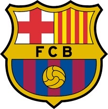

+++
title = "Fc Barcelona "
date = "2024-03-28"
draft = false
pinned = false
image = "fda52999-d288-49d5-8c6b-7a3e1adac203_4_5005_c.jpeg"
+++
 Der FC Barcelona ist einer der renommiertesten Fußballvereine der Welt und hat eine reiche Geschichte voller Triumphe und legendärer Spieler. Gegründet im Jahr 1899, hat der Club seinen Sitz in Barcelona, Katalonien, Spanien. Die charakteristischen blau-roten Farben und das berühmte Wappen mit dem St. Georgs-Kreuz sind weltweit erkennbar. 

Barcelona hat im Laufe der Jahre zahlreiche nationale und internationale Trophäen gewonnen, darunter mehrere spanische Meisterschaften (La Liga), Copa del Rey-Titel sowie Champions-League-Titel. Eine Ära besonderer Dominanz erlebte der Club unter der Führung von Trainer Pep Guardiola in den späten 2000er Jahren, als sie dreimal in kurzer Folge die UEFA Champions League gewannen.

```

Tikitaka:
Der Verein ist bekannt für sein einzigartiges Spielsystem, 
genannt "Tiki-Taka", das auf Ballbesitz, schnellen Pässen und fließendem Spiel 
basiert. Die Liste der herausragenden Spieler, 
die das Barcelona-Trikot getragen haben, 
ist lang und umfasst Legenden wie Johan Cruyff, Diego Maradona,
Ronaldinho und Lionel Messi, der viele Jahre lang das Gesicht des Clubs war 
und als einer der größten Fußballer aller Zeiten gilt.



```

Neben seinem sportlichen Erfolg ist der FC Barcelona auch für sein soziales Engagement und seine Bemühungen um die Förderung von Bildung und Integration bekannt. Der Club betreibt eine der besten Fußballakademien der Welt, La Masia, die Talente ausbildet und fördert, und engagiert sich in verschiedenen wohltätigen Projekten zur Unterstützung der Gemeinschaft.



 Mit einer riesigen globalen Fangemeinde und einem prestigeträchtigen Erbe bleibt der FC Barcelona ein Synonym für Exzellenz im Fußball und eine Quelle endloser Inspiration für Spieler und Fans auf der ganzen Welt.